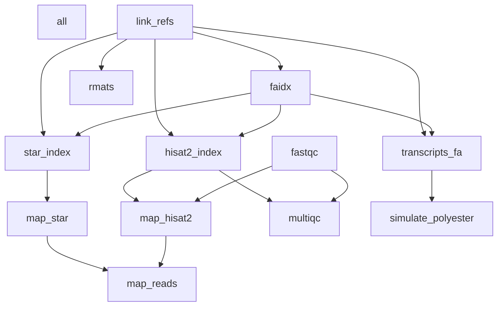

```mermaid
flowchart TB
  all["all"]
  faidx["faidx"]
  fastqc["fastqc"]
  hisat2_index["hisat2_index"]
  link_refs["link_refs"]
  map_hisat2["map_hisat2"]
  map_reads["map_reads"]
  map_star["map_star"]
  multiqc["multiqc"]
  rmats["rmats"]
  simulate_polyester["simulate_polyester"]
  star_index["star_index"]
  transcripts_fa["transcripts_fa"]
  faidx --> hisat2_index
  faidx --> star_index
  faidx --> transcripts_fa
  fastqc --> map_hisat2
  fastqc --> multiqc
  hisat2_index --> map_hisat2
  hisat2_index --> multiqc
  link_refs --> faidx
  link_refs --> hisat2_index
  link_refs --> rmats
  link_refs --> star_index
  link_refs --> transcripts_fa
  map_hisat2 --> map_reads
  map_star --> map_reads
  star_index --> map_star
  transcripts_fa --> simulate_polyester
```