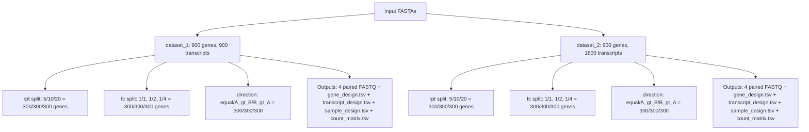

# Polyester Simulation Design Diagram

Run output base:
`results/polyester_design_run_2026-02-27_final`

## Plain Text Version

- dataset_1
  - genes: 900
  - transcripts: 900
  - rpt levels: 5, 10, 20 (300 genes each)
  - fc ratios: 1:1, 1:2, 1:4 (300 genes each)
  - directions: equal, A_gt_B, B_gt_A (300 genes each)
  - outputs: sample_01_1/2.fasta.gz, sample_02_1/2.fasta.gz, gene_design.tsv, transcript_design.tsv, sample_design.tsv, count_matrix.tsv

- dataset_2
  - genes: 900
  - transcripts: 1800
  - rpt levels: 5, 10, 20 (300 genes each)
  - fc ratios: 1:1, 1:2, 1:4 (300 genes each)
  - directions: equal, A_gt_B, B_gt_A (300 genes each)
  - outputs: sample_01_1/2.fasta.gz, sample_02_1/2.fasta.gz, gene_design.tsv, transcript_design.tsv, sample_design.tsv, count_matrix.tsv
